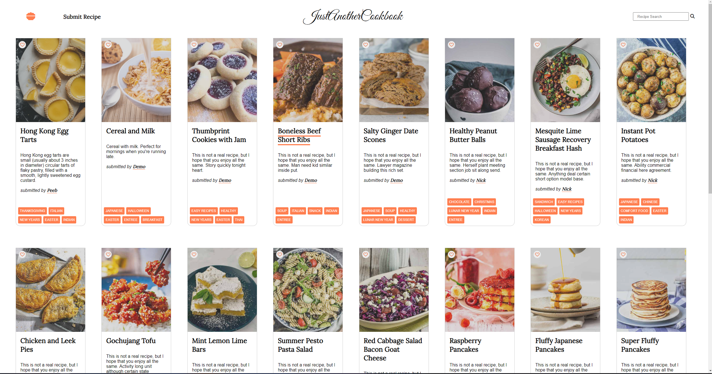
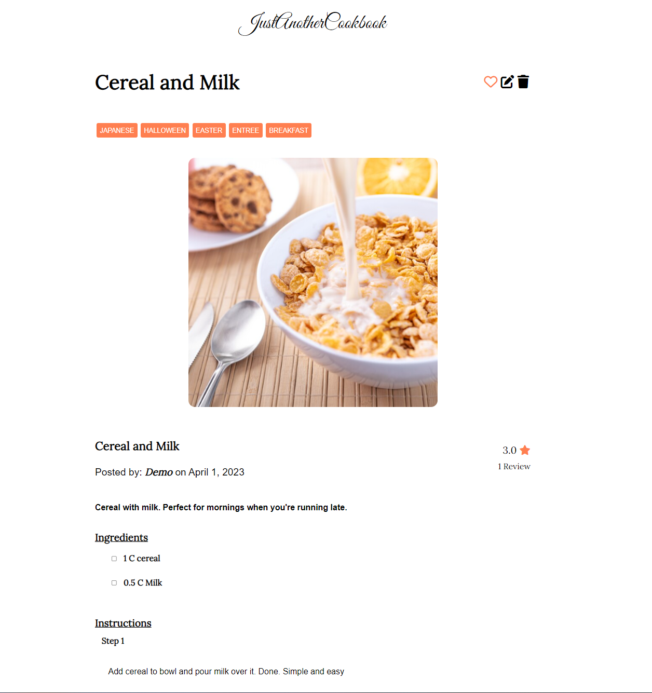

# JustAnotherCookbook

JustAnotherCookbook is a recipe sharing website where food lovers can easily share their recipes.  JustAnotherCookbook is a modified clone of [Trivet Recipes](https://trivet.recipes/), and was created with idea that finding and sharing a fantastic recipe should be as simple and easy as possible. So whether it's finding inspiration for tonight's dinner or sharing your wonderful creations with the rest of the world, we hope that you will enjoy using our site.

Check [JustAnotherCookbook](https://justanothercookbook.onrender.com) (hosted on Render)

## Index
[MVP Features](https://github.com/NickArakaki/JustAnotherCookbook/wiki/Features) | [Database Schema](https://github.com/NickArakaki/JustAnotherCookbook/wiki/Database-Schema) | [User Stories](https://github.com/NickArakaki/JustAnotherCookbook/wiki/User-Stories) | [Wire Frames](https://github.com/NickArakaki/JustAnotherCookbook/wiki/Wireframes)

## Technologies Used
Backend:


Frontend:


Hosting:


Version Control:


## Splash Page


## Recipe Details



## Getting Started
1. Clone this repositiory
    ```
    https://github.com/NickArakaki/JustAnotherCookbook
    ```

2. Run the following command in the root directory to insall the backend dependencies
    ```
    pipenv install -r requirements.txt
    ```

3. Create a .env file in the root directory based on the .env.example provided

4. Set up your database with information from your .env and then run the following commands to initialize and seed your database:
    ```
    pipenv shell
    ```
    ```
    flask db upgrade
    ```
    ```
    flask seed all
    ```

5. Start the backend application by running the following command in the terminal
    ```
    flask run
    ```

6. In another terminal, change directories to /react-app, and run the following commands to install the necessary frontend dependencies and run the application
    ```
    npm install
    ```
    ```
    npm start
    ```

7. Now you can use the Demo User account or Create your own account locally


## Amazon Web Services S3
* For more information on how to set up AWS please refer to this [guide](https://github.com/jdrichardsappacad/aws-s3-pern-demo)
